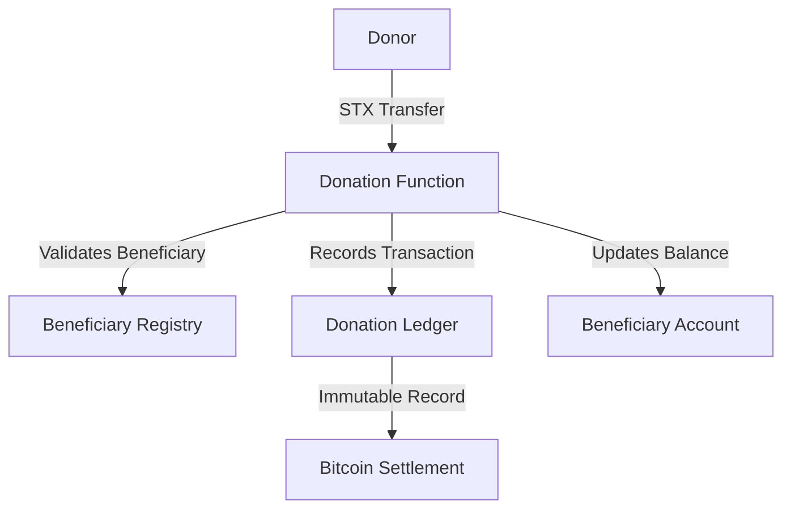
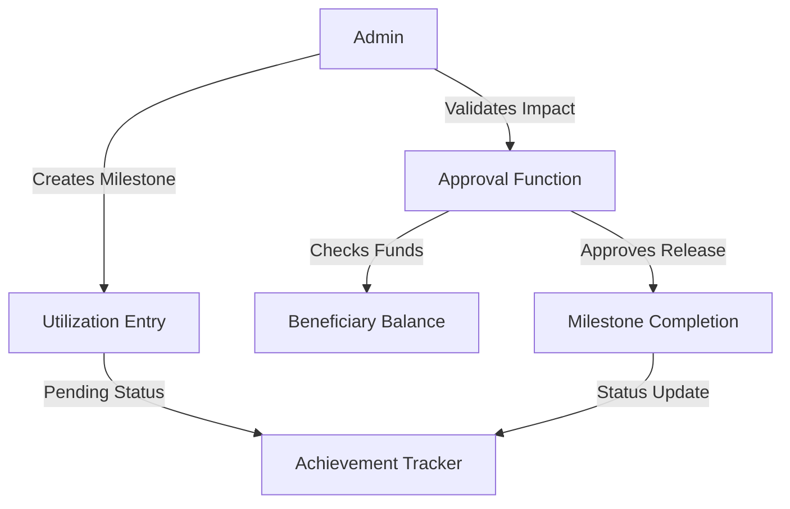
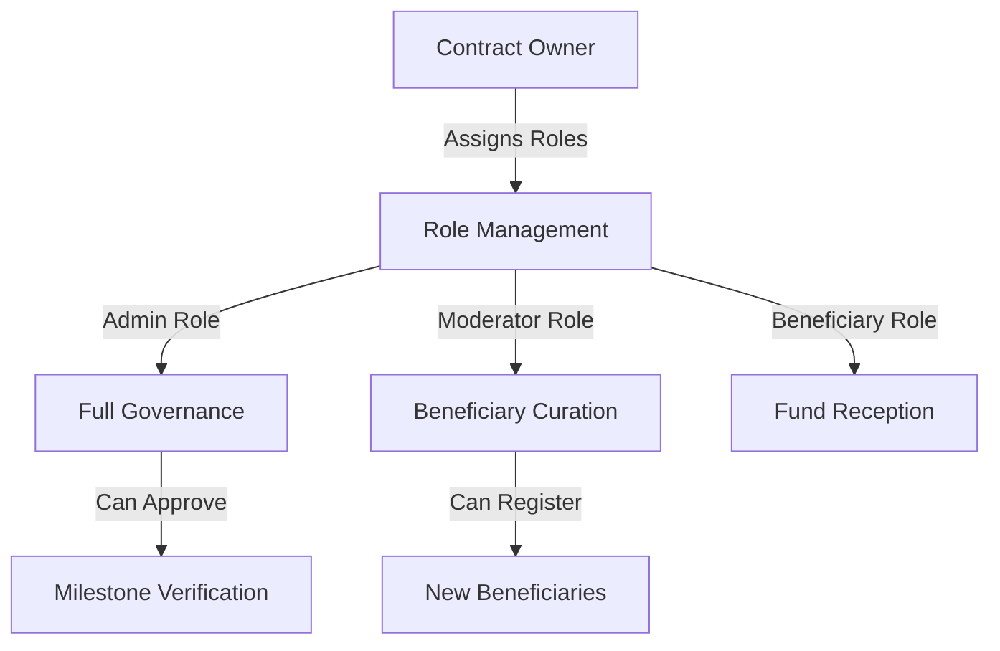

# BitFlow - Bitcoin-Native Donation Management Protocol

[](https://stacks.co/)
[](https://bitcoin.org/)
[](https://opensource.org/licenses/MIT)

BitFlow transforms charitable giving through Bitcoin's immutable ledger technology. Our protocol enables direct community impact tracking with cryptographic proof of fund allocation, ensuring donors witness real-world outcomes while beneficiaries access capital through verified achievement gates.

## 🚀 Key Features

- **Bitcoin-Secured Transparency**: Every transaction backed by Bitcoin's immutable ledger
- **Milestone-Driven Impact**: Funds released through verified achievement checkpoints
- **Zero-Trust Verification**: Cryptographic proof eliminates intermediary dependencies
- **Real-Time Tracking**: Live donation flow and utilization monitoring
- **Role-Based Access Control**: Multi-tier permission system for governance
- **Stacks Layer 2 Integration**: Fast, cost-effective Bitcoin-native operations

## 📋 Prerequisites

- Stacks blockchain node or access to Stacks testnet/mainnet
- Clarity smart contract development environment
- STX tokens for contract deployment and transactions

## 🛠 Installation & Deployment

### Local Development Setup

```bash
# Clone the repository
git clone https://github.com/joy-chiamaka/bitflow.git
cd bitflow-protocol

# Install Clarinet (Stacks development tool)
curl --proto '=https' --tlsv1.2 -sSf https://sh.rustup.rs | sh
cargo install clarinet-cli

# Initialize project
clarinet new bitflow
cd bitflow
```

### Contract Deployment

```bash
# Deploy to Stacks testnet
clarinet deploy --testnet

# Deploy to Stacks mainnet
clarinet deploy --mainnet
```

## 🏗 System Overview

BitFlow operates as a three-layer verification system built on Stacks Layer 2:

### Layer 1: Bitcoin Settlement

- Final transaction settlement on Bitcoin blockchain
- Immutable record keeping and security guarantees
- Cryptographic proof of all fund movements

### Layer 2: Stacks Smart Contracts

- Fast transaction processing and complex logic execution
- Role-based access control and governance
- Real-time donation and milestone tracking

### Layer 3: Application Interface

- User-friendly donation and monitoring interfaces
- Beneficiary registration and management
- Impact reporting and transparency dashboards

## 🏛 Contract Architecture

### Core Components

```
BitFlow Smart Contract
├── Role Management System
│   ├── Admin Role (Full governance)
│   ├── Moderator Role (Beneficiary curation)
│   └── Beneficiary Role (Fund recipients)
├── Beneficiary Registry
│   ├── Identity verification
│   ├── Target amount tracking
│   └── Status management
├── Donation Engine
│   ├── STX token transfers
│   ├── Immutable transaction logs
│   └── Real-time balance updates
└── Milestone Verification
    ├── Achievement tracking
    ├── Fund release approvals
    └── Impact validation
```

### Data Structures

| Structure | Purpose | Access Level |
|-----------|---------|--------------|
| `roles` | User permission mapping | Admin-controlled |
| `beneficiaries` | Verified recipient registry | Public read |
| `donations` | Immutable giving history | Public read |
| `utilization` | Milestone achievement log | Admin-controlled |

## 🔄 Data Flow Architecture

### Donation Flow



### Milestone Approval Flow



### Access Control Flow



## 📚 API Reference

### Public Functions

#### Donation Management

```clarity
(donate (beneficiary-id uint) (amount uint))
```

Execute Bitcoin-backed donation to verified beneficiary.

#### Beneficiary Registration

```clarity
(register-beneficiary (name string-utf8) (description string-utf8) (target-amount uint))
```

Register new verified impact recipient (Moderator+ required).

#### Milestone Creation

```clarity
(add-utilization (beneficiary-id uint) (description string-utf8) (amount uint))
```

Create achievement milestone for fund release (Admin required).

#### Milestone Approval

```clarity
(approve-utilization (utilization-id uint) (beneficiary-id uint))
```

Validate milestone completion and approve fund release (Admin required).

### Read-Only Functions

#### Query Beneficiary

```clarity
(get-beneficiary (id uint))
```

Retrieve beneficiary profile and funding status.

#### Query Donation

```clarity
(get-donation-by-id (donation-id uint))
```

Access immutable donation transaction record.

#### Query Utilization

```clarity
(get-utilization-by-id (utilization-id uint))
```

Review milestone achievement details.

## 🔒 Security Features

- **Immutable Audit Trail**: All transactions permanently recorded on Bitcoin
- **Multi-Signature Governance**: Role-based access prevents single points of failure
- **Fund Verification**: Milestone approvals require sufficient balance validation
- **Self-Protection Mechanisms**: Prevents admin self-modification or removal
- **Input Validation**: Comprehensive parameter checking across all functions

## 🧪 Testing

```bash
# Run contract tests
clarinet test

# Check contract syntax
clarinet check

# Simulate transactions
clarinet console
```

## 📈 Usage Examples

### Register a Beneficiary

```clarity
(contract-call? .bitflow register-beneficiary 
  u"Local Food Bank" 
  u"Providing meals to families in need during economic hardship" 
  u1000000) ;; 1,000 STX target
```

### Make a Donation

```clarity
(contract-call? .bitflow donate u1 u50000) ;; Donate 50 STX to beneficiary #1
```

### Create Achievement Milestone

```clarity
(contract-call? .bitflow add-utilization 
  u1 
  u"Purchased 500 meals for distribution" 
  u300000) ;; 300 STX milestone
```

## 🤝 Contributing

1. Fork the repository
2. Create a feature branch (`git checkout -b feature/amazing-feature`)
3. Commit your changes (`git commit -m 'Add amazing feature'`)
4. Push to the branch (`git push origin feature/amazing-feature`)
5. Open a Pull Request

## 📄 License

This project is licensed under the MIT License - see the [LICENSE](LICENSE) file for details.

## 🙏 Acknowledgments

- Stacks Foundation for Layer 2 infrastructure
- Bitcoin community for immutable security foundation
- Open-source contributors and charitable organizations worldwide
